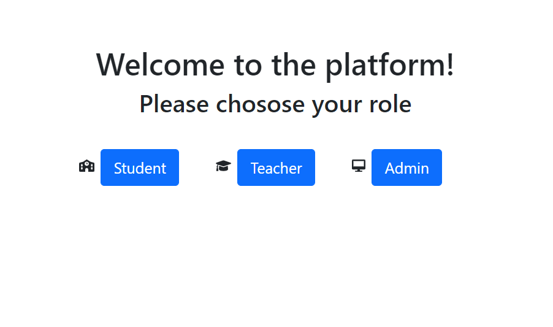
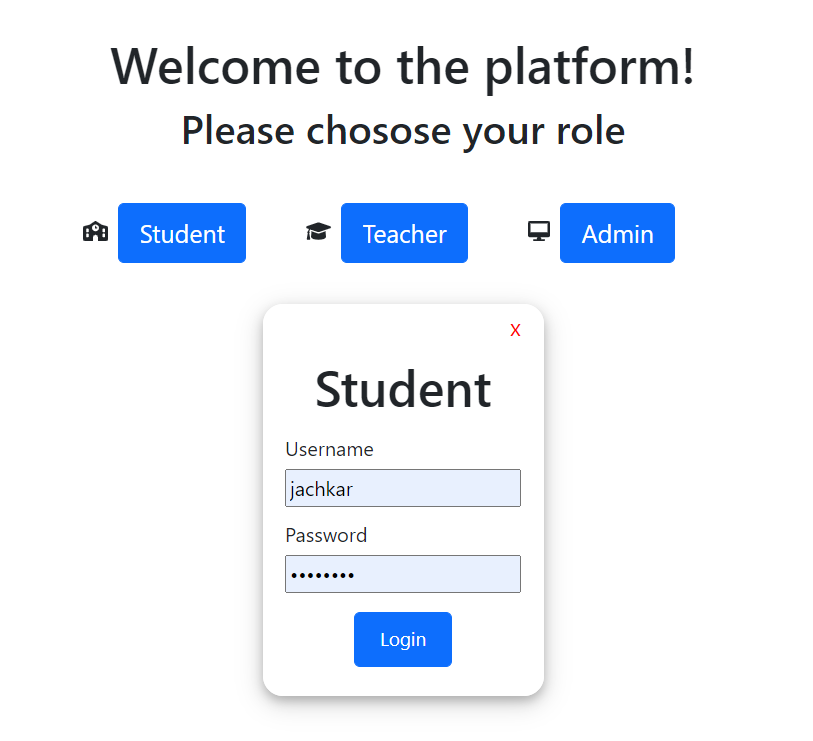
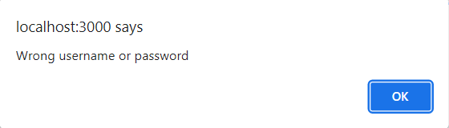
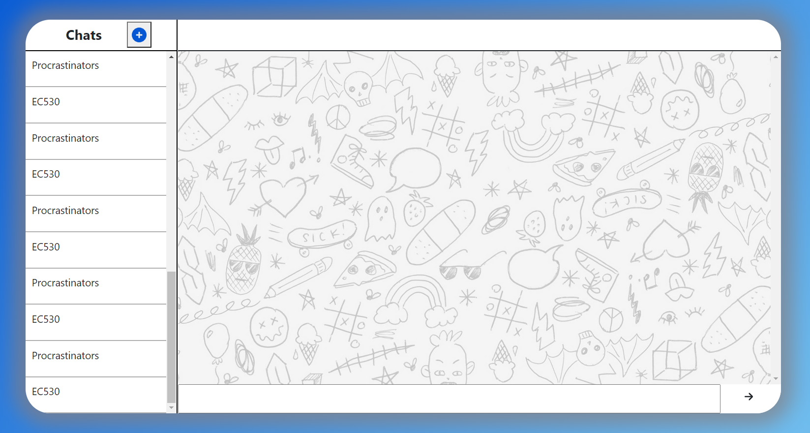
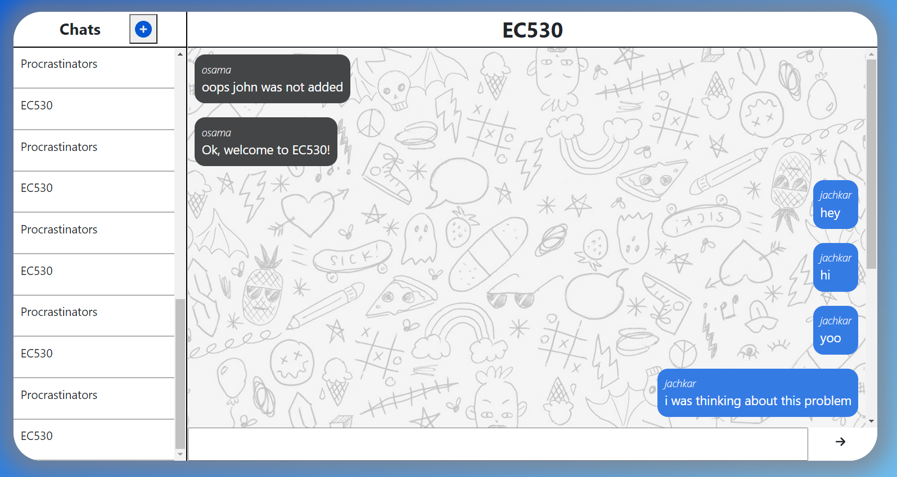
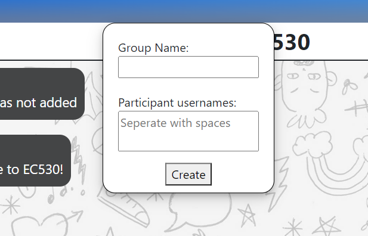

# EC530 Final Project

Team members:

- Jean Marc Achkar, jmachkar@bu.edu
- Daniel Cabrera, dcabrera@bu.edu
- John Mikulskis, jkulskis@bu.edu

## Table of Contents

- [Project Overview](#project-overview)
- [Tech Specs](#tech-specs)
- [TODO](#todo)
  - [Frontend](#frontend)
  - [Backend](#backend)
- [Run Locally](#run-locally)
- [How to Use](#how-to-use)
- [Code Hierarchy](#code-hierarchy)
- [Backend](#backend-1)
  - [Database](#database)
  - [API Server](#api-server)
- [API Calls](#api-calls)

## Project Overview

For our final project, we decided to make a web app for students and teachers to be able to chat with each other using a centralized system. Our web app supports private conversations in addition to group chats.

## Tech Specs

- Frontend:
  - Javascript
  - React
  - css
  - HTML
- APIs and servers:
  - Python
  - Flask
- Database:
  - SQLite

## TODO

### Frontend

- [x] Login screen with different roles
- [x] Chat screen with chats and messages
- [x] Add a new conversation
- [ ] Implement an admin screen to add users
- [ ] Implement a grades screen for students
- [ ] Implement a add new grade screen for teachers
- [ ] Tab bar navigation to redirect to grades dashboard

### Backend

- [x] Relational database models for messaging
  - [x] User model
  - [x] Message model
  - [x] Conversation model
  - [x] Participants model
- [x] Create POST and GET methods for each resource
- [x] Error checking
- [ ] Web sockets for notification system
- [ ] Relational database model for grade system
  - [ ] Grades model
  - [ ] Class model

## Run Locally

- Open two terminal sessions within the project directory.
- In terminal 1, run `cd ./ChatModule`
- Run `pip install -r requirements.txt`
- Run the API server `python chatServer.py`
- In terminal 2, run `cd ./platform`
- Run `npm install`
- Run the web hosting server `npm start` (this should open a web page on your browser with the url "http://localhost:3000")

## How to Use

The home page is where users can log in using their credentials. You must first select your role by clicking on the corresponding button.



When you click on your desired role, a login form will pop up asking for your username and password. These fields are required in order to move to the next screen. Changing your role will dynamically update the form to show the selected role.



When you click on the login button, an API call will be made to authenticate the user and check if the user exists in the database and whether the password is correct or not.

If the user does not exist, or the password was incorrect, an alert will be displayed on the window.



If the user does exist, they will be redirected to the chat screen.



The chat app will load up all the chats this user is part of and display them on the side-bar to the left. A user can click on any of their chats to display the messages and send messages to that chat. A double click will trigger the chat to scroll to the bottom of the chat where the most recent messages are displayed.



The messages will be displayed in order of their sent time, and the username of the person who sent the message will show up above the message bubble.

The user can send messages by typing in the textarea and by clicking the enter key or by clicking on the arrow button on the bottom right of the screen.

A new chat can be created by clicking on the plus button by "Chats" on the top left of the screen.
This will open a draggable form on the same window prompting the user for a group name and the username of the participants they would like to add to the chat seperated by white spaces.



Upon clicking on create, the new group will be added to the user's list of chats and all the participants will be added to the conversation provided their username exists on the database.

## Code Hierarchy

Our code is seperated in different directories for better understanding and ease of use.

All the backend code written in Python is located under the [`./ChatModule`](./ChatModule/) folder.

- [`chatServer.py`](./ChatModule/chatServer.py): This file contains the actual API server that is run with all the resources and POST and GET methods
- [`models.py`](./ChatModule/models.py): This file contains the definition of each database model used for our web app, such as:
  - Message model
  - User model
  - Conversation model
  - Participant model
- [`test_chat.py`](./ChatModule/test_chat.py): This file was used to test our API using the Python requests library. This is also where we added the users and conversations displayed on the screenshots of the app

These files are explained more thoroughly in the [backend section](#backend-1)

All the web app development code is written inside the [`./platform`](./platform/) directory. This directory was created using the create react app command offered by React JS. All the source code can be found under the [`./src`](./platform/src/) folder. this directory contains three seperate folders:

- [`components`](./platform/src/components/): Contains all the different jsx files with the class components that make up our app
- [`images`](./platform/src/images/): Contains all the screenshots and images used in our code
- [`screens`](./platform/src/screens/): This is where the main screens are coded and where our main components are called. These js files are the highest in the hierarchy of components (they are the class components we call in our [`index.js`](./platform/src/index.js) file), and where most of the API calls are made and state changes are set

## Backend

Endpoints and usage:


### Database

We chose to implement a SQL model because our data is highly regular and suitable for tables. Each row holds all the information you'd need, so access times will be faster using a SQL model rather than a NoSQL model. 

Entity Relationship Diagram:


### API server

We chose to implement a RESTful API, making operations easy to conceptualize. Each table was modeled as a class with CRUD methods. While we only implemented POST and GET operations, PUT, DELETE, and PATCH operations can be easily integrated becuase of our RESTful design. 

Resource definitions:

```
class MsgResource(flask_restx.resource.Resource)                                                                         |  MsgResource(api=None, *args, **kwargs)                                                                               |                                                                                                                       |  Method resolution order:                                                                                             |      MsgResource                                                                                                      |      flask_restx.resource.Resource                                                                                    |      flask.views.MethodView                                                                                           |      flask.views.View                                                                                                 |      builtins.object                                                                                                  |                                                                                                                       |  Methods defined here:                                                                                                |                                                                                                                       |  get(self, username, password, conversationID)                                                                        |                                                                                                                       |  mediatypes lambda resource_cls                                                                                       |                                                                                                                       |  post(self, username, password, conversationID)

class ConversationResource(flask_restx.resource.Resource)                                                                |  ConversationResource(api=None, *args, **kwargs)                                                                      |                                                                                                                       |  Method resolution order:                                                                                             |      ConversationResource                                                                                             |      flask_restx.resource.Resource                                                                                    |      flask.views.MethodView                                                                                           |      flask.views.View                                                                                                 |      builtins.object                                                                                                  |                                                                                                                       |  Methods defined here:                                                                                                |                                                                                                                       |  get(self, username, password)                                                                                        |                                                                                                                       |  mediatypes lambda resource_cls                                                                                       |                                                                                                                       |  post(self, username, password)                                                                                       |                                                                                                                       |  ----------------------------------------------------------------------                                               |  Data and other attributes defined here:                                                                              |                                                                                                                       |  __annotations__ = {}                                                                                                 |                                                                                                                       |  endpoint = 'conversation_resource'                                                                                   |                                                                                                                       |  methods = {'GET', 'POST'} 

class UserResource(flask_restx.resource.Resource)                                                                        |  UserResource(api=None, *args, **kwargs)                                                                              |                                                                                                                       |  Method resolution order:                                                                                             |      UserResource                                                                                                     |      flask_restx.resource.Resource                                                                                    |      flask.views.MethodView                                                                                           |      flask.views.View                                                                                                 |      builtins.object                                                                                                  |                                                                                                                       |  Methods defined here:                                                                                                |                                                                                                                       |  get(self, username, password)                                                                                        |                                                                                                                       |  mediatypes lambda resource_cls                                                                                       |                                                                                                                       |  post(self, username, password)                                                                                       |                                                                                                                       |  ----------------------------------------------------------------------                                               |  Data and other attributes defined here:                                                                              |                                                                                                                       |  __annotations__ = {}                                                                                                 |                                                                                                                       |  endpoint = 'user_resource'                                                                                           |                                                                                                                       |  methods = {'GET', 'POST'} 

class ParticipantResource(flask_restx.resource.Resource)                                                                 |  ParticipantResource(api=None, *args, **kwargs)                                                                       |                                                                                                                       |  Method resolution order:                                                                                             |      ParticipantResource                                                                                              |      flask_restx.resource.Resource                                                                                    |      flask.views.MethodView                                                                                           |      flask.views.View                                                                                                 |      builtins.object                                                                                                  |                                                                                                                       |  Methods defined here:                                                                                                |                                                                                                                       |  get(self, username, password, conversationID)                                                                        |                                                                                                                       |  mediatypes lambda resource_cls                                                                                       |                                                                                                                       |  post(self, username, password, conversationID)                                                                       |                                                                                                                       |  ----------------------------------------------------------------------                                               |  Data and other attributes defined here:                                                                              |                                                                                                                       |  __annotations__ = {}                                                                                                 |                                                                                                                       |  endpoint = 'participant_resource'                                                                                    |                                                                                                                       |  methods = {'GET', 'POST'} 
```

## API calls

The information on the web app needs to constantly be updated and refreshed to get the most recent data. This is why on most button clicks, a rerendering is done to refresh the states and get possibly new data from the database (like new messages or new conversations).

Our API calls our handled in the parent components (like [`loginScreen.js`](./platform/src/screens/loginScreen.js) and [`chatScreen.js`](./platform/src/screens/chatScreen.js)) and the data is then passed down as props to the children components.

In the login screen, we do a get request to make sure the user exists in the database with the correct password:

```javascript
handleLogin = () => {
  fetch(
    BASE + "/users/" + this.state.curr.username + "/" + this.state.curr.password
  ).then((response) => {
    if (response.status !== 200) {
      alert("Wrong username or password");
    } else {
      var pw = [];
      for (let index = 0; index < this.state.curr.password.length; index++) {
        const code = this.state.curr.password.charCodeAt(index);
        pw.push(code);
      }
      window.location.assign(
        `http://localhost:3000/chat/${this.state.curr.role}/${
          this.state.curr.username
        }/${pw.join("-")}`
      );
    }
  });
};
```

If the user is authenticated, the username and password are passed to the url as data for the next screen. The password is encoded to not display the user's password on the url.

In the chat screen, we need to do API calls to get all the user's conversation, get the messages of each conversation, post new messages sent by the user, and post new chats created by the user.
The get conversation request happens in the `componentDidMount()` function, which basically is called right after the component gets mounted on the page. This allows us to make the API call once and rerender the screen with the new data:

```javascript
componentDidMount() {
    const out = this.getUserPassword();
    console.log("Ths is running again");
    fetch(BASE + "/conversations/" + out[0] + "/" + out[1])
      .then((response) => {
        if (response.status !== 200) {
          alert("Something went wrong");
          console.log(response.statusText);
        } else {
          return response.json();
        }
      })
      .then((data) => {
        console.log(data);
        return data;
      })
      .then((chats) => {
        if (chats === undefined) {
          this.setState({});
          console.log("empty");
        } else {
          this.setState({ chats, user: out[0], password: out[1] });
          console.log(this.state.chats);
        }
        console.log("done get convos");
      });
  }
```

The getUserPassword function is called first to retrieve the data from the url, since we need the username and password to make the API requests.

```javascript
getUserPassword = () => {
  const url = window.location.href;
  const a = url.split("/");
  const user = a[5];
  const pw = a[6];
  var pwList = pw.split("-");

  var password = "";
  for (let index = 0; index < pwList.length; index++) {
    const char = String.fromCharCode(pwList[index]);
    password += char;
  }

  const out = [user, password];
  return out;
};
```

Another complicated case of calling our API is when the user creates a new chat. Since we are using a relational database, we need to make an API POST request to post the conversation data to the conversation table, and the new participants data to the participants table:

```javascript
addGroup = (name, participants) => {
  // post group in convo table
  fetch(
    BASE + "/conversations/" + this.state.user + "/" + this.state.password,
    {
      method: "POST",
      headers: {
        "Content-type": "application/json",
      },
      body: JSON.stringify({ name: name }),
    }
  )
    .then((response) => {
      // Check response code to see if can move on
      if (response.status !== 200) {
        alert("Something went wrong");
        console.log(response.statusText);
      } else {
        return response.json();
      }
    })
    .then((data) => {
      console.log(data);
      return data;
    })
    .then((conversation) => {
      // If new data is correct, we move on by doing a post for each participant
      if (conversation === undefined) {
        console.log("Something failed, conversation response is undefined");
      } else {
        let chats = this.state.chats;
        chats.push(conversation);
        this.setState({ chats });
        console.log("Posted new conversation");
        console.log({ chats });
        for (let index = 0; index < participants.length; index++) {
          const element = participants[index];
          fetch(
            BASE +
              "/participants/" +
              this.state.user +
              "/" +
              this.state.password +
              "/" +
              conversation.ID.toString(),
            {
              method: "POST",
              headers: {
                "Content-type": "application/json",
              },
              body: JSON.stringify({ participant: element }),
            }
          )
            .then((response) => {
              if (response.status !== 200) {
                alert("Something went wrong");
                console.log(response.statusText);
              } else {
                return response.json();
              }
            })
            .then((data) => {
              console.log(data);
              return data;
            })
            .then((participant) => {
              if (participant === undefined) {
                console.log(
                  "Something failed, participant response is undefined"
                );
              } else {
                console.log(
                  "New participant " +
                    participant.username +
                    " added to convo " +
                    conversation.name
                );
              }
            });
        }
      }
    });
};
```

We first make sure that the new conversation has been posted to the database, and then follow up for each participant with an API POST request to the participants table and make sure these have passed.

https://www.youtube.com/watch?v=xL_tYrEcP9M
